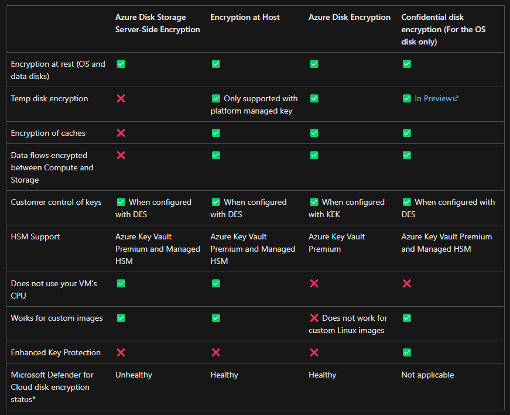

# Azure Linux Security

> [!NOTE]
> Make sure you enable [host-based encryption][7] in the subscription before you start

Generate the `.auto.tfvars` from the [template](config/template.tfvars):

```sh
cp config/template.tfvars .auto.tfvars
```

Set your public IP address in the `allowed_source_address_prefixes` variable using CIDR notation:

Create a temporary key for the Virtual Machine:

```sh
mkdir .keys && ssh-keygen -f .keys/azure
```

Deploy the resources:

```sh
terraform init
terraform apply
```

Connect to the VM and [mount the data disk][9]. The script at [scripts/mount_new_disk.sh](scripts/mount_new_disk.sh) can be adapted for this.

> [!IMPORTANT]
> Make sure mount is persistent after reboots

## Protecting local secrets

If storing secrets locally in disk is unavoidable, extra protections should be provisioned.

> [!IMPORTANT]
> When implementing advanced features, check limits and restrictions that might apply

- Tunneling from the origin to destination
- Restrict origin addresses at the destination (IP, SNI)
- Proper file permissions setup
- Strong admin user access control
- Disk encryption with customer-managed key (CMK)
- Platform-specific encryption technology (Azure Encryption-at-Host, ADE)
- Use HSM

Complex approaches:

- Use a custom kernel module to change root access permissions (SELinux, AppArmor)
- Security events monitoring (SIEM)
- Auditing

Other approaches (not as effective, side effects):

- Encrypted locally but with password in the same filesystem (chicken and the egg problem)
- Create the secret files with a hidden prefix (".")
- Use a random name for the files

### Strong disk encryption

There are different options for disk encryption, as in this [article][1]. There is a comparison table as well.




### System user permissions

Following this [threat][2], there are some ways of increasing the security of local secrets.

Login as super user:

```sh
sudo su -
```

Create the system user with the `-r` option ([manual pages][3]):

```sh
# A system user does not have a password, a home dir, and is unable to login
useradd -r litapp
```

Create the appliation directory and assign ownership:

```sh
mkdir /opt/litapp
chown -R litapp /opt/litapp
```

Switch to the `litapp` user:

```sh
sudo -u litapp -s
```

Enter the directory and create the sample key:

```sh
cd /opt/litapp
ssh-keygen -f sample_rsa
```

Once the sample key is created, restrict the access to the files to **read only**:

> [!TIP]
> The `execute` permission is required to cd into the directory

```sh
# Owner read-only to files
chmod 400 /opt/litapp/sample_rsa
chmod 400 /opt/litapp/sample_rsa.pub

# Owner read and execute for the directory
chmod 500 /opt/litapp
```

For advanced protection for the root user, a [custom kernel][4] might have to be written. Modules such as with [SELinux][5] or [AppArmor][6].

### Encryption

Key Vaults might have [limited capabilities for keys][8].

> [!IMPORTANT]
> This project uses a Key Vault with Private Link to test CMK scenarios (in case there are network restrictions)

### Security events monitoring (SIEM)

A SIEM-like approach can be used to monitor these directories that react to user actions that could potentially compromise the secrets.

## Create Privileged User

### Root Access

Createt the user:

```sh
sudo adduser newusername
sudo usermod -aG sudo newusername
```

Verify:

```sh
groups newusername
su - newusername
sudo whoami
```

While logged in with the "newusername", set the SSH authentication key:

```sh
# On your server (logged as an existing sudo user):
sudo mkdir -p /home/newusername/.ssh
sudo nano /home/newusername/.ssh/authorized_keys
```

Alternatively, change the ownership afterwards:

```sh
sudo chown -R newusername:newusername /home/newusername/.ssh
sudo chmod 700 /home/newusername/.ssh
sudo chmod 600 /home/newusername/.ssh/authorized_keys
```

### Password Logins

Edit the SSH config:

```sh
sudo nano /etc/ssh/sshd_config
```

Enable password authentication:

```
PasswordAuthentication yes
```

Restart the service:

```sh
sudo systemctl restart ssh
```

## Restricted Linux Administrator

This section main reference is Digital Oceans's guide on the [sudoers file][digitalocean-suduoers].

### Create User and Group

The user `linda` will be configured with limited privileges.

Create a standard user:

```sh
sudo adduser linda
```

Create the group on which to manage permissions:

```sh
sudo groupadd developers
sudo usermod -a -G developers linda
```

Grant SSH access to the user:

```sh
# Logged as "linda"
sudo su - linda
mkdir -p /home/linda/.ssh
nano /home/linda/.ssh/authorized_keys
```

### Pre-Check

Verify the current permissions state:

```sh
# Confirm current privileges
id && groups && sudo -l

# Validate sudo policy health
sudo visudo -c || echo "Sudoers has errors — use console or pkexec visudo to repair."

# Verify absolute paths for commands you intend to allow (rules match full paths)
command -v systemctl
```

If required, remove the user from the `sudo` group:

```sh
sudo deluser username sudo
```

### Command History

Privileged command execution will be available by default in the `/var/log/auth.log` file.

The following commands can be used to search for commands executed for a specific user:

```sh
sudo grep 'CWD=/home/username' /var/log/auth.log
sudo grep 'PWD=/home/username' /var/log/auth.log
sudo grep "sudo:.*username" /var/log/auth.log
```

### Create Policy Fragment

Edit a policy fragment:

```sh
# Edit or create a fragment safely
sudo visudo -f /etc/sudoers.d/99-developers
```

Validate the fragement:

```sh
sudo visudo -cf /etc/sudoers.d/99-developers
```

Create Least-Privilege Rules (Scoped Access)


```toml
# Allow developers group to run apt commands
%developers ALL=(ALL) /usr/bin/apt-get, /usr/bin/apt, /usr/bin/apt-cache, /usr/bin/dpkg

# Allow developers group to mount/unmount with VeraCrypt
%developers ALL=(ALL) NOPASSWD: /usr/bin/veracrypt
```

Apply the correct permission:

```sh
sudo chown root:root /etc/sudoers.d/99-developers
sudo chmod 0440 /etc/sudoers.d/99-developers
```

### Aliases

It's also possible to use aliases:

```toml
# /etc/sudoers.d/webops (edit with visudo -f)
# Command alias for power actions
Cmnd_Alias POWER = /sbin/shutdown, /sbin/halt, /sbin/reboot

# Users allowed to run POWER
User_Alias  GROUPTWO = brent, doris, eric
GROUPTWO ALL = POWER
```

## Migrate Disks

To execute a disk migration:

1. Create a snapshot of VM1 disk
2. Create a new disk from the snapshot
3. Attache the new disk to VM2
4. Mount the disk

The [scripts/mount_existing_disk.sh](scripts/mount_existing_disk.sh) can be adapted for this.

## Images

Sample commands to get updated images:

```sh
# Canonical
az vm image list-offers --location eastus2 --publisher Canonical --output table
az vm image list --location eastus2 --publisher Canonical --offer ubuntu-22_04-lts --sku server --all --output table

# SUSE
az vm image list --location eastus2 --publisher SUSE --offer sles-15-sp7 --sku gen2 --architecture x64 --all --output table
```

## Rsync

Thil section will implement `rsync` for file synchronization. VM1 will connect to VM2 and pull the data. Both VMs bust have `rsync` installed.

### Initial Verification

Both machines will have `LUN0` mounted on `/data/disk1`. The initialization script will reboot to ensure mount persistence.

Run the following on both machines:

```sh
# Check cloud-init execution status
cloud-init status

# Verify that the mount is persistent after the reboot
echo "hello" > /data/disk1/hello.txt

# Esure rsync is installed and versions are compatible
rsync --version

# (VM1 only) Verify network connectivity
telnet <VM2> 22
```

### Certificate

On the remote server VM2, create the `rsync` user:

```sh
sudo useradd -m -s /bin/bash rsync-test
sudo passwd rsync-test
sudo -u rsync-test mkdir -p /home/rsync-test/.ssh
sudo -u rsync-test chmod 700 /home/rsync-test/.ssh

# Optionally, lock to rsync
sudo nano /home/rsync-test/.ssh/authorized_keys
command="rsync --server --daemon .",no-port-forwarding,no-agent-forwarding,no-pty ssh-ed25519 AAAAC3NzaC1...

# Optionally, lock or disable password
sudo passwd -l rsync-test
sudo nano /etc/ssh/sshd_config
#Match User rsync-test
#    PasswordAuthentication no
```

On the local server VM1, create a key pair:

```sh
ssh-keygen -f rsync
```

Certificate exchange

### Rsync Configuration

```sh
rsync -r <origin_directory> <user>@<address>:<destination_path>
```

Options to consider:

- r: recursive
- v: verbose
- a: archive (permissions, timestamp, links, etc)
- z: compress during copy
- e: specify the remote shell to use (default is SSH)
- dry-run

Run as a service

Procedure:
1. Stop all services
2. Lock all files
3. Snapshot
4. Create users and groups on the copy target
5. Dry run before the cutover


[1]: https://learn.microsoft.com/en-us/azure/virtual-machines/disk-encryption-overview
[2]: https://superuser.com/questions/77617/how-can-i-create-a-non-login-user
[3]: https://linux.die.net/man/8/useradd
[4]: https://stackoverflow.com/a/59559335/3231778
[5]: https://blog.siphos.be/2015/07/restricting-even-root-access-to-a-folder/
[6]: https://debian-handbook.info/browse/stable/sect.apparmor.html
[7]: https://learn.microsoft.com/en-us/azure/virtual-machines/disks-enable-host-based-encryption-portal?tabs=azure-powershell#prerequisites
[8]: https://learn.microsoft.com/en-us/azure/key-vault/keys/about-keys
[9]: https://learn.microsoft.com/en-us/azure/virtual-machines/linux/attach-disk-portal
[digitalocean-suduoers]: https://www.digitalocean.com/community/tutorials/how-to-edit-the-sudoers-file
